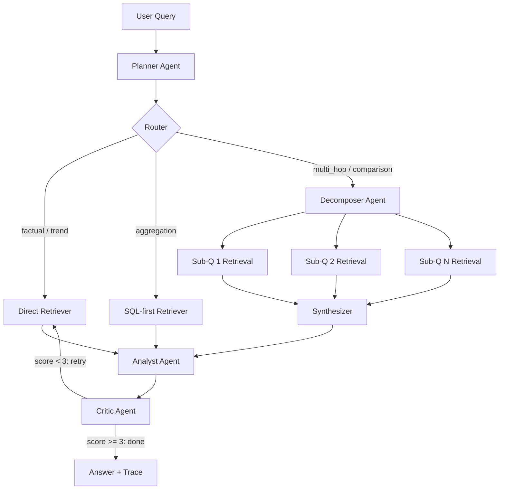
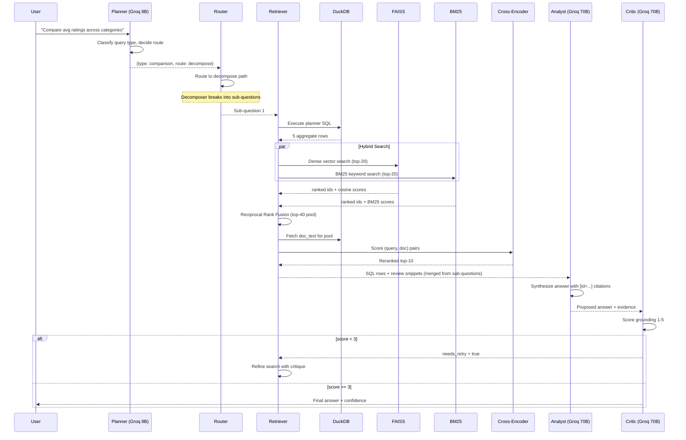
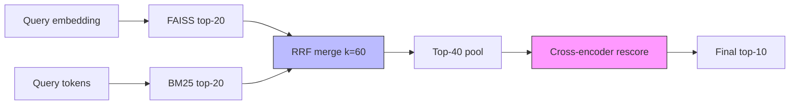
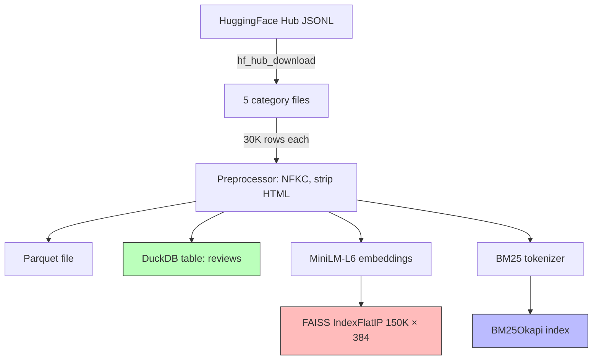
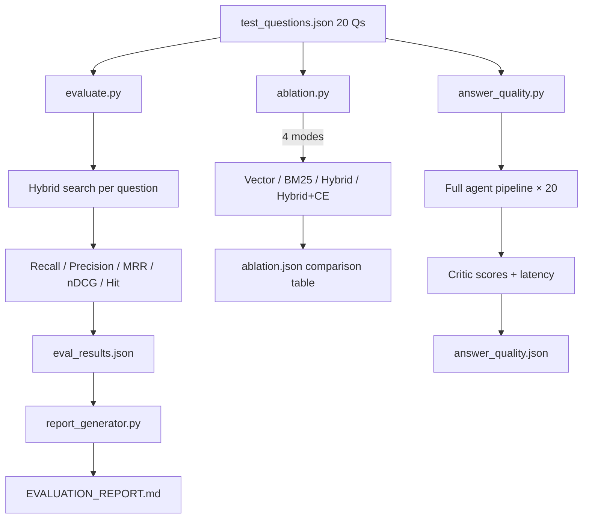

# Additional Diagrams

## Multi-agent routing

```mermaid
flowchart TD
    Q[User Query] --> Plan[Planner Agent]
    Plan --> Router{Router}

    Router -->|"factual / trend"| Direct[Direct Retriever]
    Router -->|"aggregation"| SQLFirst[SQL-first Retriever]
    Router -->|"multi_hop / comparison"| Decomp[Decomposer Agent]

    Decomp --> SQ1[Sub-Q 1 Retrieval]
    Decomp --> SQ2[Sub-Q 2 Retrieval]
    Decomp --> SQN[Sub-Q N Retrieval]
    SQ1 --> Synth[Synthesizer]
    SQ2 --> Synth
    SQN --> Synth

    Direct --> Analyst[Analyst Agent]
    SQLFirst --> Analyst
    Synth --> Analyst

    Analyst --> Critic[Critic Agent]
    Critic -->|"score < 3: retry"| Direct
    Critic -->|"score >= 3: done"| Output[Answer + Trace]
```

## Query execution sequence (direct path)

```mermaid
sequenceDiagram
    participant U as User
    participant P as Planner (Groq 8B)
    participant Rt as Router
    participant R as Retriever
    participant DB as DuckDB
    participant V as FAISS
    participant BM as BM25
    participant CE as Cross-Encoder
    participant A as Analyst (Groq 70B)
    participant C as Critic (Groq 70B)

    U->>P: "Compare avg ratings across categories"
    P->>P: Classify query type, decide route
    P-->>Rt: {type: comparison, route: decompose}

    Rt->>Rt: Route to decompose path
    Note over Rt: Decomposer breaks into sub-questions

    Rt-->>R: Sub-question 1
    R->>DB: Execute planner SQL
    DB-->>R: 5 aggregate rows

    par Hybrid Search
        R->>V: Dense vector search (top-20)
        R->>BM: BM25 keyword search (top-20)
    end
    V-->>R: ranked ids + cosine scores
    BM-->>R: ranked ids + BM25 scores
    R->>R: Reciprocal Rank Fusion (top-40 pool)
    R->>DB: Fetch doc_text for pool
    R->>CE: Score (query, doc) pairs
    CE-->>R: Reranked top-10

    R-->>A: SQL rows + review snippets (merged from sub-questions)
    A->>A: Synthesize answer with [id=...] citations
    A-->>C: Proposed answer + evidence

    C->>C: Score grounding 1-5
    alt score < 3
        C-->>R: needs_retry = true
        R->>R: Refine search with critique
    else score >= 3
        C-->>U: Final answer + confidence
    end
```

## Retrieval fusion detail

```mermaid
flowchart LR
    Q[Query embedding] --> FAISS[FAISS top-20]
    Q2[Query tokens] --> BM25[BM25 top-20]
    FAISS --> RRF[RRF merge k=60]
    BM25 --> RRF
    RRF --> Pool[Top-40 pool]
    Pool --> CE[Cross-encoder rescore]
    CE --> Top10[Final top-10]

    style CE fill:#f9f,stroke:#333
    style RRF fill:#bbf,stroke:#333
```

## Data flow (ingestion)

```mermaid
flowchart TD
    HF[HuggingFace Hub JSONL] -->|hf_hub_download| Raw[5 category files]
    Raw -->|30K rows each| Pre[Preprocessor: NFKC, strip HTML]
    Pre --> PQ[Parquet file]
    Pre --> DDB[DuckDB table: reviews]
    Pre --> EMB[MiniLM-L6 embeddings]
    EMB --> IDX[FAISS IndexFlatIP 150K × 384]
    Pre --> TOK[BM25 tokenizer]
    TOK --> BM[BM25Okapi index]

    style IDX fill:#fbb,stroke:#333
    style DDB fill:#bfb,stroke:#333
    style BM fill:#bbf,stroke:#333
```

## Evaluation pipeline

```mermaid
flowchart TD
    TQ[test_questions.json 20 Qs] --> EV[evaluate.py]
    EV --> HS[Hybrid search per question]
    HS --> MET[Recall / Precision / MRR / nDCG / Hit]
    MET --> RES[eval_results.json]
    RES --> RG[report_generator.py]
    RG --> MD[EVALUATION_REPORT.md]

    TQ --> AB[ablation.py]
    AB --> |4 modes| COMP[Vector / BM25 / Hybrid / Hybrid+CE]
    COMP --> ABR[ablation.json comparison table]

    TQ --> AQ[answer_quality.py]
    AQ --> PIPE[Full agent pipeline × 20]
    PIPE --> CRI[Critic scores + latency]
    CRI --> AQR[answer_quality.json]
```
