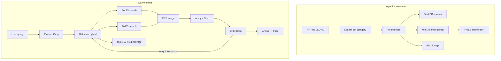

# System Architecture

## End-to-end flow

## Components

| Layer | Technology | Responsibility |
|-------|------------|----------------|
| Data | Hugging Face `huggingface_hub` | Download `raw/review_categories/*.jsonl` |
| Structured store | DuckDB | Filters, aggregations, joins (`reviews` table) |
| Dense retrieval | `sentence-transformers/all-MiniLM-L6-v2` + FAISS | Cosine similarity via normalized inner product |
| Sparse retrieval | `rank_bm25` | Keyword / lexical match |
| Fusion | Reciprocal Rank Fusion (RRF) | Merge ranked lists without score calibration |
| Planner | `llama-3.1-8b-instant` (Groq) | Query type + plan + optional `SELECT` |
| Analyst | `llama-3.3-70b-versatile` (Groq) | Grounded answer with `[id=]` citations |
| Critic | `llama-3.3-70b-versatile` (Groq) | JSON score + retry signal |
| Orchestration | LangGraph `StateGraph` | Planner → retrieve → analyst → critic → optional retry |

## Observability

- JSON lines to stdout and `logs/app.log` via `src/observability/logger.py`
- Gradio shows agent trace + retrieved ids

## Security

- `SqlStore.query_safe` allows only single-statement `SELECT` on `reviews` (no DDL/DML).
