# System Architecture

## End-to-end flow

```mermaid
flowchart TD
    subgraph ingest [Ingestion one-time]
        HF[HF Hub JSONL] --> Load[Loader per category]
        Load --> Prep[Preprocessor]
        Prep --> DDB[DuckDB reviews]
        Prep --> EMB[MiniLM embeddings]
        EMB --> FAISS[FAISS IndexFlatIP]
        Prep --> BM25[BM25Okapi]
    end

    subgraph online [Query online -- multi-agent]
        Q[User query] --> P[Planner Agent]
        P --> Router{Router}

        Router -->|"aggregation"| SQL1[SQL-first Retriever]
        Router -->|"multi_hop / comparison"| Decomp[Decomposer Agent]
        Router -->|"factual / trend"| Direct[Direct Retriever]

        Decomp --> SubRet[Sub-question Retrieval]
        SubRet --> Synth[Synthesizer]

        SQL1 --> Analyst[Analyst Agent]
        Synth --> Analyst
        Direct --> Analyst

        Analyst --> Critic[Critic Agent]
        Critic -->|"retry if low score"| Direct
        Critic --> Output[Answer + trace]
    end
```

## Multi-agent routing

The Planner classifies each query and assigns a **route**:

| Route | When | Path |
|-------|------|------|
| `direct` | Simple factual or single-topic lookup | Planner -> Retriever -> Analyst -> Critic |
| `sql_first` | Aggregation / counting / stats queries | Planner -> SQL-first Retriever -> Analyst -> Critic |
| `decompose` | Multi-hop, comparison, complex reasoning | Planner -> Decomposer -> Sub-Retrieval -> Synthesizer -> Analyst -> Critic |

## Components

| Layer | Technology | Responsibility |
|-------|------------|----------------|
| Data | Hugging Face `huggingface_hub` | Download `raw/review_categories/*.jsonl` |
| Structured store | DuckDB | Filters, aggregations, joins (`reviews` table) |
| Dense retrieval | `sentence-transformers/all-MiniLM-L6-v2` + FAISS | Cosine similarity via normalized inner product |
| Sparse retrieval | `rank_bm25` | Keyword / lexical match |
| Fusion | Reciprocal Rank Fusion (RRF) | Merge ranked lists without score calibration |
| Rerank | Cross-encoder (MS MARCO MiniLM, CPU) | Rescore top pool after RRF; disable with `USE_CROSS_ENCODER=0` |
| Planner agent | Gemini (`gemini-2.5-flash` default) or Groq `llama-3.1-8b-instant` | Query type + route + plan + optional `SELECT` |
| Decomposer agent | Same as planner | Break multi-hop queries into 2-4 sub-questions |
| Analyst agent | Gemini (`gemini-2.5-pro` default) or Groq `llama-3.3-70b-versatile` | Grounded answer with `[id=]` citations |
| Critic agent | Gemini (`gemini-2.5-flash` default) or Groq `llama-3.3-70b-versatile` | JSON score + retry signal |
| LLM routing | `src/llm/chat.py` | If both Gemini + Groq keys exist: **Gemini first**, **Groq fallback** on errors / rate limits |
| Orchestration | LangGraph `StateGraph` | Multi-path routing with conditional edges |

## Observability

- **Structured JSON logs** to stdout and `logs/app.log` via `src/observability/logger.py`
- **Trace ID** correlation across all log events within a pipeline invocation
- **LangSmith** (optional): set `LANGCHAIN_TRACING_V2=true` + `LANGCHAIN_API_KEY` for automatic tracing of all LangChain/LangGraph calls
- **OpenTelemetry** (optional): set `OTEL_ENABLED=true` for per-node spans exported to console or OTLP collector
- **Gradio UI**: Agent Trace tab shows routing decisions, sub-questions, latency, and critic feedback

## Deployment

- **Docker**: `docker build -t bigdata-qna . && docker run -p 7860:7860 --env-file .env bigdata-qna`
- **Render**: push repo, Render auto-detects `render.yaml` (Docker service with persistent disk for data)

## Security

- `SqlStore.query_safe` allows only single-statement `SELECT` on `reviews` (no DDL/DML).
